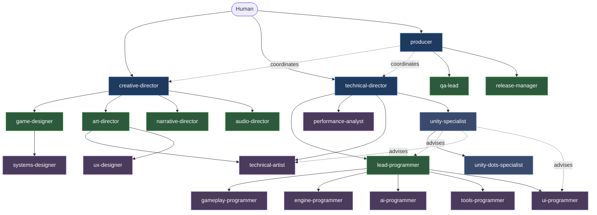

# Agent + Human Coordination Rules

## Roles

**Human** = final decision maker. Approves design, scope, file writes, releases.

**Agents** organized in three tiers:
- **Tier 1 — Leadership**: creative-director, technical-director, producer. Vision, architecture, schedule.
- **Tier 2 — Department Leads**: game-designer, lead-programmer, art-director, audio-director, narrative-director, qa-lead, release-manager. Domain ownership, review, delegation to specialists.
- **Tier 3 — Specialists**: implementers within a single domain (gameplay code, systems design, VFX, UX, etc.).
- **Engine specialists**: `unity-specialist` (engine authority, reports to technical-director), `unity-dots-specialist` (ECS/Jobs/Burst, reports to unity-specialist). Advise programmers and technical-artist on engine patterns without owning their domain files.

## Hierarchy

Solid arrows = delegation. Dotted = coordination/advisory (no ownership).

## Core Coordination Rules

1. **Vertical delegation**: leadership в†’ department leads в†’ specialists. Never skip a tier for complex decisions.
2. **Horizontal consultation**: same-tier agents may consult, but cannot make binding decisions outside their domain.
3. **No unilateral cross-domain changes**: never modify files outside designated directories without explicit delegation.
4. **Conflict resolution**: escalate to shared parent. No shared parent в†’ creative-director (design) or technical-director (technical).
5. **Change propagation**: producer coordinates when a change affects multiple domains.
6. **Document every decision**: verbal-only agreements lead to contradictions. Write it down.
7. **Tasks ≤ 1-3 days**: larger tasks must be broken down before assignment.
8. **No assumption-based implementation**: ambiguous spec в†’ ask the specifier. Wrong guess costs more than a question.

## Delegation Matrix

| From | Can Delegate To |
|------|----------------|
| creative-director | game-designer, art-director, audio-director, narrative-director |
| technical-director | lead-programmer, performance-analyst, technical-artist (technical decisions), unity-specialist |
| producer | any agent (task assignment within their domain) |
| game-designer | systems-designer |
| lead-programmer | gameplay/engine/ai/tools/ui programmers |
| art-director | technical-artist, ux-designer |
| release-manager | tools-programmer (builds), qa-lead (release testing) |
| unity-specialist | unity-dots-specialist (DOTS/ECS); advises lead-programmer, programming specialists, technical-artist on Unity patterns |
| unity-dots-specialist | (advises all programmers on DOTS/ECS, Burst optimization) |

Department leads without sub-specialists absorb that scope directly. Examples: `audio-director` absorbs sound-designer/composer scope; `narrative-director` absorbs writer, world-builder, and localization scope; `qa-lead` absorbs qa-tester scope; `tools-programmer` absorbs devops/build-engineer scope; `ux-designer` absorbs accessibility-specialist scope; `producer` absorbs analytics and community-manager scope; `unity-specialist` absorbs Unity shader, addressables, and UI specialist scope.

## Escalation Paths

| Situation | Escalate To |
|-----------|------------|
| Two designers disagree on a mechanic | game-designer |
| Game design vs narrative conflict | creative-director |
| Game design vs technical feasibility | producer в†’ creative-director + technical-director |
| Code architecture disagreement | technical-director |
| Cross-system code conflict | lead-programmer в†’ technical-director |
| Schedule conflict between departments | producer |
| Scope exceeds capacity | producer в†’ creative-director (for cuts) |
| Quality gate disagreement | qa-lead в†’ technical-director |
| Performance budget violation | performance-analyst flags в†’ technical-director decides |

## Subagents vs Agent Teams

**Subagents** (default): spawned via Task within one Claude Code session. Share permission context. Run sequentially or in parallel within session.

**Agent teams** (experimental, opt-in): independent sessions, own context windows. Use when:
- Workstreams touch different files
- Each takes >30 min
- 3+ specialists work parallel epics

Skip agent teams when one session's output feeds another (use subagents) or task fits a single context.

## Parallel Task Protocol

When orchestrating multiple independent agents:
1. Issue all independent Task calls before waiting
2. Collect all results before dependent phases
3. Surface BLOCKED agents immediately, never silently skip
4. Produce partial report if some block

## Workflow Patterns

### New Feature
creative-director (vision check) в†’ game-designer (spec) в†’ producer (schedule) в†’ lead-programmer (architecture) в†’ specialist (implementation) в†’ technical-artist + narrative-director + audio-director (as needed) в†’ qa-lead (test) в†’ lead-programmer (review) в†’ producer (close).

### Bug Fix
qa-lead (report + triage) в†’ producer (assign) в†’ lead-programmer (root cause) в†’ specialist (fix) в†’ lead-programmer (review) в†’ qa-lead (verify + regression).

### Balance Adjustment
producer (identify) в†’ game-designer (evaluate vs intent) в†’ systems-designer (model) в†’ game-designer (approve) в†’ data update в†’ qa-lead (regression) в†’ producer (monitor).

### Sprint Cycle
producer (plan) в†’ all agents execute в†’ producer (daily status) в†’ qa-lead + lead-programmer (continuous review) в†’ producer (retro + next plan).

### Milestone Checkpoint
producer (review) в†’ directors (creative/technical/quality reviews) в†’ producer (facilitate go/no-go) в†’ directors (scope decisions) в†’ producer (document).

### Release Pipeline
producer (declare RC) в†’ release-manager (cut branch + checklist) в†’ qa-lead (regression sign-off) в†’ narrative-director (loc check) в†’ performance-analyst (benchmarks) в†’ tools-programmer (build) в†’ release-manager (changelog + tag) в†’ technical-director (sign-off) в†’ release-manager (deploy + monitor).

## Cross-Domain Notifications

When **design doc** changes в†’ game-designer notifies lead-programmer, qa-lead, producer, affected specialists.

When **architecture decision (ADR)** changes в†’ technical-director notifies lead-programmer, affected specialists, qa-lead, producer.

When **art bible / asset standards** change в†’ art-director notifies technical-artist, content creators, tools-programmer (if pipeline affected).

## Anti-Patterns

- **Bypassing hierarchy**: specialist makes a lead-level decision without consultation
- **Cross-domain implementation**: editing files outside designated area without delegation
- **Shadow decisions**: agreements without written record
- **Monolithic tasks**: assigning >3-day work without breakdown
- **Assumption-based implementation**: guessing instead of asking the spec owner
