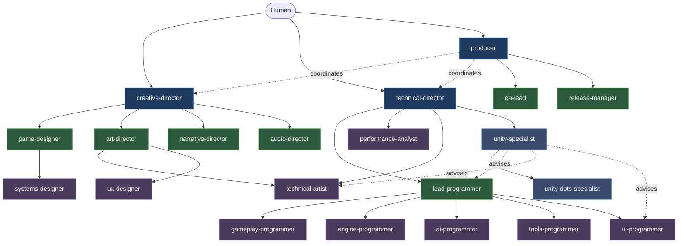

# Agentic Game Studio

[](https://docs.claude.com/claude-code)
[](LICENSE)
[]()
[]()

Solo-dev framework for building games with Claude Code. Provides a structured agent hierarchy, document templates, and a slash-command skill set that turn Claude Code into a collaborative studio.

Heavily inspired by [Claude-Code-Game-Studios](https://github.com/Donchitos/Claude-Code-Game-Studios).

## What it is

A ruleset, skill catalog, and template library that sits on top of Claude Code. You stay the decision maker; specialized agents (designer, programmer, QA, etc.) act as expert consultants. Engine-agnostic in design — concrete rules currently target **Unity** only.

## Requirements

- Claude Code — either the [CLI](https://docs.claude.com/claude-code) or the desktop app
- Git
- A target game engine (Unity recommended; others viable but rules unverified)

## Quick start

```bash
git clone <this-repo> my-game
cd my-game
```

Open the project in Claude Code (CLI: run `claude` in the project directory; desktop app: open the folder as a workspace), then:

1. Run `/ags-start` — guided onboarding: interaction style, engine + version, game concept, review intensity.
2. Bootstrap design via `/ags-brainstorm` → `/ags-map-systems` → `/ags-create-architecture`.
3. Plan first vertical slice with `/ags-create-epics`, then `/ags-create-stories`.
4. Implement, review, close epic via `/ags-gate-check epic-done` → `/ags-epic-retro`.
5. Stuck? Run `/ags-help` for context-aware next steps.

## Repository layout

```
CLAUDE.md             Master config loaded by Claude Code
.claude/              Skills, agent definitions, hooks, settings
.ags/
  rules/              Behavioral rules (collab, coding, coordination, ...)
  templates/          Document templates
  project/            Live project state (state.md, stage.md, epics/, ...)
  docs/               Engine API snapshots, references
design/               GDDs, ADRs, art bible, UX, narrative
assets/               Game assets
tests/                Test code
<engine project>/     Engine source (e.g. Assets/ for Unity)
```

## Core concepts

| Term | Meaning |
|------|---------|
| **Epic** | A vertical slice covering 1–3 systems, shipped end-to-end |
| **Story** | 1–3 day task within an epic |
| **Stub** | Temporary implementation of a neighbour system, marked `// TODO(epic-id)` and tracked in `stubs.md` |
| **ADR** | Architecture Decision Record for any significant technical choice |
| **Gate** | Quality checkpoint that blocks phase or epic close until criteria pass |
| **state.md** | The single active-session file; overwritten on each new task |
| **stage.md** | Persistent project phase + active epic + transition history |

## Human ↔ agent collaboration

Every interaction follows: **Question → Options → Decision → Draft → Approval**.

- Agents ask, present 2–4 options with trade-offs, draft on your decision, and request explicit approval before writing files.
- You drive direction. Agents never write or commit without confirmation.
- Multi-section documents are written incrementally, one approved section at a time.

## Agent hierarchy

Three tiers plus engine specialists. Leadership delegates down; specialists never make cross-domain changes without delegation.



Solid arrows = delegation. Dotted = coordination/advisory.

## Workflow

The project moves through four phases tracked in `stage.md`:

**Concept → Production → Polish → Release**

Phase transitions are gated. Within Production, work is structured as a loop of vertical-slice **epics**:

```
plan ──► design ──► contracts ──► stories ──► implement
  ▲                                              │
  │                                              ▼
retro ◄── close (gate) ◄── review ◄── verify ◄──┘
```

Each epic delivers a playable slice. Stubs let you defer neighbour systems without blocking; the gate refuses to close an epic that leaves stubs without a migration plan. Decisions log in `decisions-log.md`; epics index in `epics/index.md`.

## Customization

Tune behaviour by editing the rule files — they are loaded automatically:

| File | Controls |
|------|----------|
| [CLAUDE.md](CLAUDE.md) | Top-level project config and rule includes |
| [.ags/rules/user-interaction.md](.ags/rules/user-interaction.md) | Tone, verbosity, language |
| [.ags/rules/context-management.md](.ags/rules/context-management.md) | State files, compaction strategy |
| [.ags/rules/coding.md](.ags/rules/coding.md) | Engineering principles, tests, stubs, performance |
| [.ags/rules/coordination.md](.ags/rules/coordination.md) | Agent hierarchy, delegation, escalation |
| [.ags/rules/directory-structure.md](.ags/rules/directory-structure.md) | Repo layout |
| [.ags/templates/](.ags/templates/) | Document templates (all follow t_* naming) |
| [.claude/skills/](.claude/skills/) | Slash-command skills |

## Credits

Heavily inspired by Donchitos' [Claude-Code-Game-Studios](https://github.com/Donchitos/Claude-Code-Game-Studios).

## License

[MIT](LICENSE).
