# Agent Coordination

This document defines the organisational structure for all AI agents in this project:
the 4-level hierarchy, escalation rules, communication flow, and the Agent Responsibilities
Reference. It is the authoritative source for deciding which agents to engage for any topic.

Concrete agent definitions live in `agents/<agent-name>.md` and must conform to `agent-template.md`.

---

## Hierarchy

The project uses a 4-level structure:

- Level 1 - CEO: The human user. Ultimate decision-maker. Not an AI agent.
- Level 2 - C-Level Agents: AI agents responsible for strategic domains (e.g. creative-director, technical-director, producer).
- Level 3 - Team-Lead Agents: AI agents managing specific functional teams under a C-Level.
- Level 4 - Specialist Agents: AI agents executing focused, narrow domain tasks.

```mermaid
graph TD
    CEO["Level 1 — CEO (Human)"]

    CD["Level 2 — creative-director"]
    TD["Level 2 — technical-director"]
    PR["Level 2 — producer"]

    GD["Level 3 — game-designer"]
    AD["Level 3 — art-director"]
    ND["Level 3 — narrative-director"]
    AUD["Level 3 — audio-director"]
    LOD["Level 3 — live-ops-designer"]

    LP["Level 3 — lead-programmer"]
    QAL["Level 3 — qa-lead"]
    RM["Level 3 — release-manager"]
    SEC["Level 3 — security-engineer"]
    LL["Level 3 — localization-lead"]
    PT["Level 3 — prototyper"]
    ACCS["Level 3 — accessibility-specialist"]
    UE3["Level 3 — unreal-specialist"]
    UN3["Level 3 — unity-specialist"]
    GO3["Level 3 — godot-specialist"]

    CM["Level 3 — community-manager"]

    SYD["Level 4 — systems-designer"]
    LVD["Level 4 — level-designer"]
    ECD["Level 4 — economy-designer"]
    TA["Level 4 — technical-artist"]
    UXD["Level 4 — ux-designer"]
    WR["Level 4 — writer"]
    WB["Level 4 — world-builder"]
    SD["Level 4 — sound-designer"]

    GPP["Level 4 — gameplay-programmer"]
    EP["Level 4 — engine-programmer"]
    AIP["Level 4 — ai-programmer"]
    NP["Level 4 — network-programmer"]
    TP["Level 4 — tools-programmer"]
    UIP["Level 4 — ui-programmer"]
    QAT["Level 4 — qa-tester"]

    PA["Level 4 — performance-analyst"]
    DO["Level 4 — devops-engineer"]
    AE["Level 4 — analytics-engineer"]

    UEGAS["Level 4 — ue-gas-specialist"]
    UEBP["Level 4 — ue-blueprint-specialist"]
    UEREP["Level 4 — ue-replication-specialist"]
    UEUMG["Level 4 — ue-umg-specialist"]

    UDOTS["Level 4 — unity-dots-specialist"]
    USHD["Level 4 — unity-shader-specialist"]
    UADDR["Level 4 — unity-addressables-specialist"]
    UUISP["Level 4 — unity-ui-specialist"]

    GGDS["Level 4 — godot-gdscript-specialist"]
    GSHD["Level 4 — godot-shader-specialist"]
    GEXT["Level 4 — godot-gdextension-specialist"]

    CEO --> CD
    CEO --> TD
    CEO --> PR

    CD --> GD
    CD --> AD
    CD --> ND
    CD --> AUD
    CD --> LOD

    TD --> LP
    TD --> QAL
    TD --> RM
    TD --> SEC
    TD --> LL
    TD --> PT
    TD --> ACCS
    TD --> UE3
    TD --> UN3
    TD --> GO3
    TD --> PA
    TD --> DO
    TD --> AE

    PR --> CM

    GD --> SYD
    GD --> LVD
    GD --> ECD

    AD --> TA
    AD --> UXD

    ND --> WR
    ND --> WB

    AUD --> SD

    LP --> GPP
    LP --> EP
    LP --> AIP
    LP --> NP
    LP --> TP
    LP --> UIP

    QAL --> QAT

    UE3 --> UEGAS
    UE3 --> UEBP
    UE3 --> UEREP
    UE3 --> UEUMG

    UN3 --> UDOTS
    UN3 --> USHD
    UN3 --> UADDR
    UN3 --> UUISP

    GO3 --> GGDS
    GO3 --> GSHD
    GO3 --> GEXT

    classDef level2 fill:#4a90d9,color:#fff,stroke:#2c6fad
    classDef level3 fill:#7bc47f,color:#000,stroke:#4e9e52
    classDef level4 fill:#f5c842,color:#000,stroke:#c9a200

    class CD,TD,PR level2
    class GD,AD,ND,AUD,LOD,LP,QAL,RM,SEC,LL,PT,ACCS,UE3,UN3,GO3,CM level3
    class SYD,LVD,ECD,TA,UXD,WR,WB,SD,GPP,EP,AIP,NP,TP,UIP,QAT,PA,DO,AE,UEGAS,UEBP,UEREP,UEUMG,UDOTS,USHD,UADDR,UUISP,GGDS,GSHD,GEXT level4
```

**Diagram Legend**

- Level 1 (CEO / Human): single root node; ultimate decision-maker — no fill colour (default)
- Level 2 (C-Level): blue fill — strategic domain owners — creative-director, technical-director, producer
- Level 3 (Team-Lead): green fill — functional team leads and engine-lead specialists reporting to a C-Level
- Level 4 (Specialist): yellow fill — narrow-domain executors and engine sub-specialists reporting to a Team-Lead

> **Note:** `performance-analyst`, `devops-engineer`, and `analytics-engineer` are Level 4 agents that report directly to `technical-director` (Level 2) with no Level 3 intermediary. Because Mermaid places nodes by path depth from the root, these three nodes render at the same visual row as Level 3 agents in the diagram above, despite their yellow Level 4 styling.

---

## Escalation Rules

**Disagreement:** When agents disagree and cannot reach a decision through lateral negotiation — regardless of whether they are at the same level, from the same branch, or from different branches — the conflict is resolved by recursive hierarchical escalation:

1. Each conflicting agent identifies its direct parent in the hierarchy (as shown in the diagram above).
2. Those parent agents attempt to resolve the conflict directly between themselves.
3. If the parent agents cannot agree, the conflict is escalated one level further up the chain: each parent identifies its own direct parent, and those agents attempt resolution.
4. This process repeats level by level until either the conflict is resolved at some level or it reaches the CEO, who makes the final binding decision.

"Direct parent" means the agent's immediate supervisor as shown in the hierarchy diagram — not the most domain-relevant agent at the level above.

**Special case — shared direct parent:** If step 1 yields the same parent for both conflicting agents (i.e., the two agents are siblings in the hierarchy who share a direct parent), step 2 collapses: there is only one parent agent, so that parent resolves the conflict directly without a lateral-negotiation step between parents. This applies to any sibling pair — for example, `systems-designer` and `level-designer` (both under `game-designer`), or `release-manager` and `qa-lead` (both under `technical-director`).

**Special case — L4 direct reports:** `performance-analyst`, `devops-engineer`, and `analytics-engineer` report directly to `technical-director` (no Level 3 intermediary). This means they share `technical-director` as their direct parent with each other and with all Level 3 agents under `technical-director`. Any disagreement between these agents, or between one of them and a Level 3 peer, falls under the shared-direct-parent rule above: `technical-director` resolves the conflict directly.

**Blocked:** When an agent cannot proceed (missing permissions, outside its scope, lacks information):

1. Report the blocker upward to the direct parent agent with a clear description of what is needed.
2. Do not attempt to acquire permissions or expand scope unilaterally.
3. If the parent cannot resolve the blocker, it escalates further up the chain until it reaches the CEO.

Agents must not attempt to resolve cross-domain conflicts unilaterally. Escalation is not a
sign of failure - it is the correct procedure for maintaining clear ownership.

---

## Communication Flow

- Top-down: Task assignment flows from higher levels to lower levels.
  The CEO assigns work to C-Level agents; C-Level agents delegate to Team-Lead agents;
  Team-Lead agents direct Specialist agents.
  Exception: `performance-analyst`, `devops-engineer`, and `analytics-engineer` are Level 4
  agents with no Level 3 intermediary — they receive work directly from `technical-director`.

- Bottom-up: Results, status updates, and blockers are reported upward.
  Specialists report to their Team-Lead; Team-Leads report to their C-Level; C-Levels report to the CEO.
  Exception: the three L4 direct-report agents above report directly to `technical-director`.

- Lateral: Agents at the same level may collaborate directly as peers.
  Lateral collaboration does not require routing through a parent unless a conflict arises.
  Lateral communication should be transparent - outcomes are still reported upward.

---

## Agent Responsibilities Reference

This table is the primary lookup for deciding which agents to involve for a given topic.
Each row maps an agent to its area of responsibility and the types of questions or tasks
that belong to it.

| Agent File | Level | Area of Responsibility | Involve For |
|---|---|---|---|
| agents/creative-director.md | 2 - C-Level | Creative strategy and vision | Overall creative direction, tone, cross-team creative alignment, creative conflicts |
| agents/technical-director.md | 2 - C-Level | Technology strategy and engineering direction | Architecture decisions, tech stack choices, build/CI/CD strategy, engineering standards |
| agents/producer.md | 2 - C-Level | Production, scheduling, and community | Milestone planning, resource allocation, community strategy, release coordination |
| agents/game-designer.md | 3 - Team-Lead | Game design and player experience | Game systems design, gameplay loop, feature specs, design review |
| agents/art-director.md | 3 - Team-Lead | Visual art direction and standards | Art style consistency, asset quality bar, UX visual standards |
| agents/narrative-director.md | 3 - Team-Lead | Narrative and writing direction | Story structure, lore consistency, writing pipeline, world canon |
| agents/audio-director.md | 3 - Team-Lead | Audio direction and standards | Sound design vision, music direction, audio implementation guidelines |
| agents/lead-programmer.md | 3 - Team-Lead | Programming team management | Code architecture, programming standards, feature scoping with engineering |
| agents/qa-lead.md | 3 - Team-Lead | Quality assurance management | Test strategy, bug triage policy, QA pipeline, release readiness |
| agents/release-manager.md | 3 - Team-Lead | Release and deployment coordination | Release planning, deployment gates, version management, go/no-go decisions |
| agents/security-engineer.md | 3 - Team-Lead | Security standards and review | Security audits, threat modelling, auth/authorisation review, vulnerability response |
| agents/localization-lead.md | 3 - Team-Lead | Localisation pipeline and standards | Translation workflows, locale-specific QA, cultural adaptation, string management |
| agents/prototyper.md | 3 - Team-Lead | Rapid prototyping and experimentation | Throwaway prototypes, mechanic validation, quick feasibility proofs |
| agents/accessibility-specialist.md | 3 - Team-Lead | Accessibility standards and implementation | Accessibility audits, WCAG/game-a11y compliance, assistive feature design |
| agents/live-ops-designer.md | 3 - Team-Lead | Live operations and ongoing content design | Events, seasonal content, live feature specs, economy balancing coordination for live game (via economy-designer) |
| agents/unreal-specialist.md | 3 - Team-Lead | Unreal Engine platform expertise | UE architecture decisions, plugin selection, Unreal best-practice review |
| agents/unity-specialist.md | 3 - Team-Lead | Unity platform expertise | Unity architecture decisions, package selection, Unity best-practice review |
| agents/godot-specialist.md | 3 - Team-Lead | Godot platform expertise | Godot architecture decisions, addon selection, Godot best-practice review |
| agents/community-manager.md | 3 - Team-Lead | Community engagement and feedback | Community communications, player feedback triage, social channel management |
| agents/systems-designer.md | 4 - Specialist | Game systems and mechanics design | Rules systems, combat mechanics, progression systems, skill trees, economy rules |
| agents/level-designer.md | 4 - Specialist | Level and environment design | Map layout, encounter placement, environmental storytelling, pacing |
| agents/economy-designer.md | 4 - Specialist | In-game economy and monetisation design | Currency sinks/sources, drop rates, store pricing, economy balance |
| agents/technical-artist.md | 4 - Specialist | Art pipeline and technical art | Shaders, VFX, art tool pipeline, performance-friendly asset setup |
| agents/ux-designer.md | 4 - Specialist | User experience and interface design | UI layout, player onboarding flows, HUD design, accessibility UX |
| agents/writer.md | 4 - Specialist | Game writing and dialogue | Quest text, NPC dialogue, item descriptions, cutscene scripts |
| agents/world-builder.md | 4 - Specialist | World lore and setting construction | Lore documents, world history, faction design, setting consistency |
| agents/sound-designer.md | 4 - Specialist | Sound effects and audio implementation | SFX creation, audio events, mix guidelines, audio asset integration |
| agents/gameplay-programmer.md | 4 - Specialist | Gameplay systems implementation | Feature implementation, player controller, game rules code, gameplay bugs |
| agents/engine-programmer.md | 4 - Specialist | Engine-level systems and core tech | Rendering pipeline, engine extensions, core systems, performance-critical code |
| agents/ai-programmer.md | 4 - Specialist | AI and behaviour programming | NPC AI, pathfinding, behaviour trees, decision systems |
| agents/network-programmer.md | 4 - Specialist | Networking and multiplayer implementation | Network architecture, replication, latency handling, multiplayer bugs |
| agents/tools-programmer.md | 4 - Specialist | Internal tooling and editor extensions | Editor tools, pipeline automation, developer-facing utilities |
| agents/ui-programmer.md | 4 - Specialist | UI and HUD implementation | UI widget implementation, UI bindings, HUD logic, menu systems |
| agents/qa-tester.md | 4 - Specialist | Manual and exploratory testing | Test case execution, bug reporting, regression testing, edge-case exploration |
| agents/performance-analyst.md | 4 - Specialist | Performance profiling and optimisation | CPU/GPU profiling, memory analysis, frame-rate budgets, performance regressions |
| agents/devops-engineer.md | 4 - Specialist | CI/CD, infrastructure, and build systems | Build pipelines, deployment automation, infrastructure provisioning, monitoring |
| agents/analytics-engineer.md | 4 - Specialist | Data and telemetry engineering | Analytics pipelines, event tracking, dashboards, data-driven insight support |
| agents/ue-gas-specialist.md | 4 - Specialist | Unreal Gameplay Ability System | GAS architecture, ability design, attribute sets, gameplay effects in Unreal |
| agents/ue-blueprint-specialist.md | 4 - Specialist | Unreal Blueprint scripting | Blueprint logic, visual scripting patterns, Blueprint optimisation |
| agents/ue-replication-specialist.md | 4 - Specialist | Unreal network replication | Actor replication, RPCs, replication graphs, Unreal multiplayer architecture |
| agents/ue-umg-specialist.md | 4 - Specialist | Unreal UMG / UI | UMG widget design, data bindings, Common UI, HUD implementation in Unreal |
| agents/unity-dots-specialist.md | 4 - Specialist | Unity DOTS / ECS | Entities, components, systems, Burst/Jobs integration, DOTS performance patterns |
| agents/unity-shader-specialist.md | 4 - Specialist | Unity shaders and visual effects | ShaderGraph, HLSL, URP/HDRP custom shaders, VFX Graph |
| agents/unity-addressables-specialist.md | 4 - Specialist | Unity Addressables and asset management | Addressable asset setup, remote content delivery, memory management in Unity |
| agents/unity-ui-specialist.md | 4 - Specialist | Unity UI Toolkit / uGUI | UI Toolkit layouts, USS, uGUI canvas setup, Unity HUD implementation |
| agents/godot-gdscript-specialist.md | 4 - Specialist | Godot GDScript programming | GDScript patterns, scene/signal architecture, GDScript performance tips |
| agents/godot-shader-specialist.md | 4 - Specialist | Godot shaders and visual effects | Godot shader language, VisualShader, post-processing, material customisation |
| agents/godot-gdextension-specialist.md | 4 - Specialist | Godot GDExtension / native modules | GDExtension bindings, C++ Godot modules, performance-critical native code |

Note: This table reflects the intended hierarchy. Entries listed here are planned agents —
they may not yet have a corresponding file in `agents/`. As agents are created and added to
`agents/`, this table must be kept in sync. Only agents with an existing file in `agents/`
are currently operative. Any agent not listed here is not officially part of the coordination
structure.

---

## Delegation Map

This section documents the allowed delegation (from → to) relationships in the hierarchy.
A delegating agent assigns work to a subordinate; the subordinate reports results back up.
Cross-team coordination paths are permitted where explicitly listed below. Cross-team paths
are coordination relationships, not hierarchical delegation — they do not carry the same
authority as a direct-parent assignment.

### Level 2 → Level 3 delegations (and direct Level 4 exceptions)

| Delegating Agent | May delegate to |
|---|---|
| creative-director | game-designer, art-director, narrative-director, audio-director, live-ops-designer |
| technical-director | lead-programmer, qa-lead, release-manager, security-engineer, localization-lead, prototyper, accessibility-specialist, unreal-specialist, unity-specialist, godot-specialist, performance-analyst (L4 direct), devops-engineer (L4 direct), analytics-engineer (L4 direct) |
| producer | community-manager |

### Level 3 → Level 4 delegations

> **Note:** `performance-analyst`, `devops-engineer`, and `analytics-engineer` receive work directly from `technical-director` (Level 2) and are not listed in this table. See the Level 2 → Level 3 table above.

| Delegating Agent | May delegate to |
|---|---|
| game-designer | systems-designer, level-designer, economy-designer |
| art-director | technical-artist, ux-designer |
| narrative-director | writer, world-builder |
| audio-director | sound-designer |
| lead-programmer | gameplay-programmer, engine-programmer, ai-programmer, network-programmer, tools-programmer, ui-programmer |
| qa-lead | qa-tester |
| release-manager | none (no L4 direct reports) |
| security-engineer | none (no L4 direct reports) |
| localization-lead | none (no L4 direct reports) |
| prototyper | none (no L4 direct reports) |
| accessibility-specialist | none (no L4 direct reports) |
| live-ops-designer | none (no L4 direct reports — see cross-team coordination paths below) |
| community-manager | none (no L4 direct reports) |
| unreal-specialist | ue-gas-specialist, ue-blueprint-specialist, ue-replication-specialist, ue-umg-specialist |
| unity-specialist | unity-dots-specialist, unity-shader-specialist, unity-addressables-specialist, unity-ui-specialist |
| godot-specialist | godot-gdscript-specialist, godot-shader-specialist, godot-gdextension-specialist |

### Cross-team coordination paths

These paths are explicitly documented because the initiating agent's domain spans the
receiving agent's area of concern. They cover both cross-chain relationships (agents in
different reporting lines) and same-chain peer relationships where the dependency is
non-obvious. These are coordination paths, not hierarchical delegation: the initiating agent
may request work or sign-off from the receiving agent, but does not hold authority over that
agent's priorities or direction.

| Initiating Agent | Coordinates with | Reason |
|---|---|---|
| release-manager | devops-engineer | Release manager owns deployment gates; devops-engineer executes the pipeline |
| release-manager | qa-lead | Release go/no-go decisions require QA readiness confirmation |
| live-ops-designer | economy-designer | Live events require economy balance adjustments |
| live-ops-designer | community-manager | Live content rollouts require community communication coordination |
| live-ops-designer | analytics-engineer | Live operations are data-driven; analytics-engineer provides telemetry support |

When a cross-team initiating agent and the receiving agent's direct parent give conflicting instructions, the direct parent's instructions take precedence. The cross-team initiating agent must escalate the conflict to its own direct parent rather than issuing instructions that override the receiving agent's chain of command.

---

## Quick-Reference: Which Agent for Which Topic?

Use this as a fast triage guide. Find the topic area, then engage the listed agent.

If the recommended agent file does not exist yet in `agents/`, handle the topic directly
with the CEO (human user) until that agent is created.

- "Should we use Unity or Godot?" -> technical-director (architecture/tech strategy)
- "The story feels tonally inconsistent" -> creative-director (creative direction)
- "Players are dropping off at level 3" -> game-designer (player experience and gameplay loop)
- "The save system is crashing" -> gameplay-programmer or engine-programmer (implementation bug), escalate to lead-programmer if systemic
- "This quest dialogue doesn't match the lore" -> writer to fix, narrative-director if it's a lore-consistency policy question
- "Level 7 is too hard" -> level-designer (balancing), escalate to game-designer if it's a systemic design question
- "We need a new test suite for combat" -> qa-lead (test strategy and plan), then qa-tester for execution once the plan is approved; escalate to lead-programmer for resourcing
