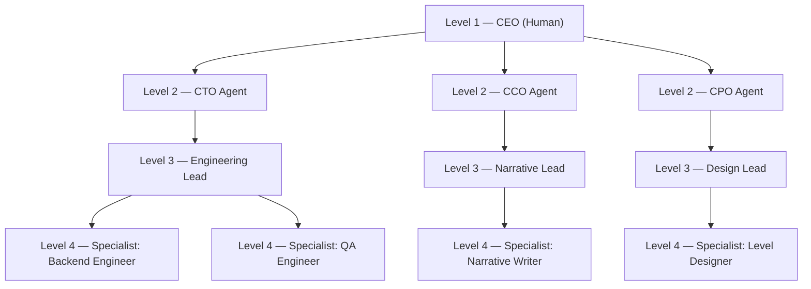

# Agent Coordination

This document defines the organisational structure for all AI agents in this project:
the 4-level hierarchy, escalation rules, communication flow, and the Agent Responsibilities
Reference. It is the authoritative source for deciding which agents to engage for any topic.

Concrete agent definitions live in `agents/<agent-name>.md` and must conform to `agent-template.md`.

---

## Hierarchy

The project uses a 4-level structure:

- Level 1 — CEO: The human user. Ultimate decision-maker. Not an AI agent.
- Level 2 — C-Level Agents: AI agents responsible for strategic domains (e.g. CTO, CCO, CPO).
- Level 3 — Team-Lead Agents: AI agents managing specific functional teams under a C-Level.
- Level 4 — Specialist Agents: AI agents executing focused, narrow domain tasks.

The diagram above shows example agents. Actual agents are listed in the
Agent Responsibilities Reference section below.

---

## Escalation Rules

**Disagreement:** When agents at the same level disagree or cannot reach a decision independently:

1. Identify the subject matter of the disagreement.
2. Determine the most appropriate parent agent on the level above whose domain covers that subject.
3. Escalate the conflict to that parent agent for resolution.
4. If the disagreement spans multiple domains (no single parent covers it), escalate to the CEO.

**Blocked:** When an agent cannot proceed (missing permissions, outside its scope, lacks information):

1. Report the blocker upward to the direct parent agent with a clear description of what is needed.
2. Do not attempt to acquire permissions or expand scope unilaterally.
3. If the parent cannot resolve the blocker, it escalates further up the chain until it reaches the CEO.

Agents must not attempt to resolve cross-domain conflicts unilaterally. Escalation is not a
sign of failure — it is the correct procedure for maintaining clear ownership.

---

## Communication Flow

- Top-down: Task assignment flows from higher levels to lower levels.
  The CEO assigns work to C-Level agents; C-Level agents delegate to Team-Lead agents;
  Team-Lead agents direct Specialist agents.

- Bottom-up: Results, status updates, and blockers are reported upward.
  Specialists report to their Team-Lead; Team-Leads report to their C-Level; C-Levels report to the CEO.

- Lateral: Agents at the same level may collaborate directly as peers.
  Lateral collaboration does not require routing through a parent unless a conflict arises.
  Lateral communication should be transparent — outcomes are still reported upward.

---

## Agent Responsibilities Reference

This table is the primary lookup for deciding which agents to involve for a given topic.
Each row maps an agent to its area of responsibility and the types of questions or tasks
that belong to it.

| Agent File | Level | Area of Responsibility | Involve For |
|---|---|---|---|
| agents/cto-agent.md | 2 — C-Level | Technology strategy and engineering direction | Architecture decisions, tech stack choices, build/CI/CD strategy, engineering standards |
| agents/cco-agent.md | 2 — C-Level | Creative and narrative direction | Story direction, tone and voice, creative vision, narrative consistency |
| agents/cpo-agent.md | 2 — C-Level | Product and design direction | Feature prioritisation, player experience, UX decisions, product roadmap |
| agents/engineering-lead.md | 3 — Team-Lead | Engineering team management | Sprint planning for engineering, code review policy, team coordination across backend/QA |
| agents/narrative-lead.md | 3 — Team-Lead | Narrative team management | Writing pipeline, lore consistency, managing narrative writers and editors |
| agents/design-lead.md | 3 — Team-Lead | Game design team management | Level design oversight, game feel, balancing, player journey |
| agents/backend-engineer.md | 4 — Specialist | Backend and systems implementation | Feature implementation, bug fixes, database schema, server-side logic |
| agents/qa-engineer.md | 4 — Specialist | Quality assurance and testing | Test plans, bug triage, regression coverage, automated testing |
| agents/narrative-writer.md | 4 — Specialist | Writing and dialogue | Quest text, NPC dialogue, item descriptions, lore entries |
| agents/level-designer.md | 4 — Specialist | Level and environment design | Map layout, encounter placement, environmental storytelling, pacing |

Note: This table reflects the intended hierarchy. As new agents are defined and added to
`agents/`, this table must be updated to include them. Any agent not listed here is not
officially part of the coordination structure.

---

## Quick-Reference: Which Agent for Which Topic?

Use this as a fast triage guide. Find the topic area, then engage the listed agent.

- "Should we use Unity or Godot?" → cto-agent (architecture/tech strategy)
- "The story feels tonally inconsistent" → cco-agent (creative direction)
- "Players are dropping off at level 3" → cpo-agent (product/player experience)
- "The save system is crashing" → backend-engineer (implementation bug), escalate to engineering-lead if systemic
- "This quest dialogue doesn't match the lore" → narrative-writer to fix, narrative-lead if it's a lore-consistency policy question
- "Level 7 is too hard" → level-designer (balancing), escalate to design-lead if it's a systemic design question
- "We need a new test suite for combat" → qa-engineer (test plan), engineering-lead for resourcing
